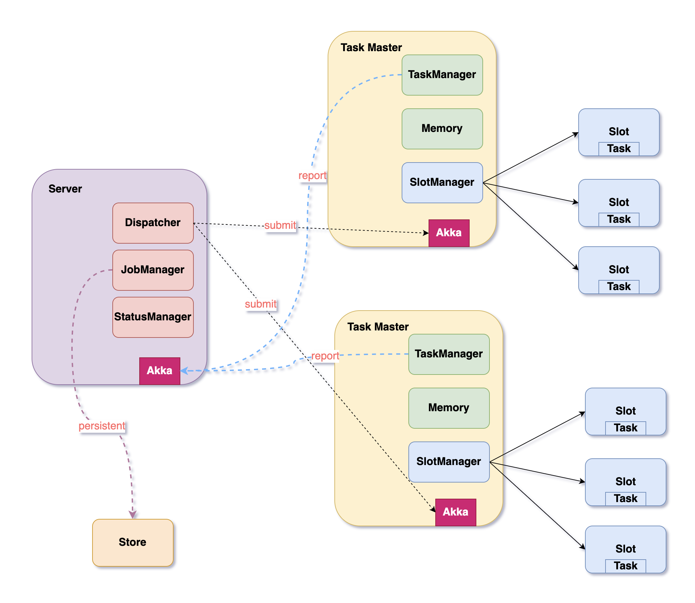

# Mixmicro Scheduler
<b> Mixmicro Scheduler </b>> is a distributed job scheduling that supports CRON, API, fixed frequency，fixed delay and other scheduling strategies.

## Overview

> Design Architecture

 

## Requirements
Java version 1.8+，you can use below command to check. 
> java -version

## Quick Start

You can download binaries from [Release Repo](https://github.com/mixmicro/mixmicro-scheduler).

*First* : unzip release package

```bash
$ tar -zxvf *.tar.gz
```

*Second* : startup & shutdown

```bash
$ sh ./bin/startup.sh -p production  
```

*Third* : check the application log

```bash
$ tail -f logs/start.log
```


## Building from Source

You don’t need to build from source to use `Mixmicro Scheduler` (binaries in [github](https://github.com/mixmicro/mixmicro-scheduler)), 
but if you want to try out the latest and greatest, 
`Mixmicro Scheduler` can be easily built with the maven wrapper. You also need JDK 1.8.

*First* : git clone source from gitlab
 
```bash
$ git clone https://github.com/mixmicro/mixmicro-scheduler
```

*Second* : build

```bash
$ mvn clean install
```

If you want to build with the regular `mvn` command, you will need [Maven v3.5.0 or above](https://maven.apache.org/run-maven/index.html).


## Document


## How to Use

```xml
```


## License
 
```
Copyright (c) 2020 YunLSP+

Permission is hereby granted, free of charge, to any person obtaining a copy
of this software and associated documentation files (the "Software"), to deal
in the Software without restriction, including without limitation the rights
to use, copy, modify, merge, publish, distribute, sublicense, and/or sell
copies of the Software, and to permit persons to whom the Software is
furnished to do so, subject to the following conditions:

The above copyright notice and this permission notice shall be included in all
copies or substantial portions of the Software.

THE SOFTWARE IS PROVIDED "AS IS", WITHOUT WARRANTY OF ANY KIND, EXPRESS OR
IMPLIED, INCLUDING BUT NOT LIMITED TO THE WARRANTIES OF MERCHANTABILITY,
FITNESS FOR A PARTICULAR PURPOSE AND NONINFRINGEMENT. IN NO EVENT SHALL THE
AUTHORS OR COPYRIGHT HOLDERS BE LIABLE FOR ANY CLAIM, DAMAGES OR OTHER
LIABILITY, WHETHER IN AN ACTION OF CONTRACT, TORT OR OTHERWISE, ARISING FROM,
OUT OF OR IN CONNECTION WITH THE SOFTWARE OR THE USE OR OTHER DEALINGS IN THE
SOFTWARE.

